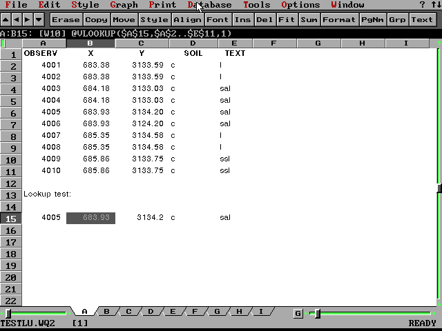

# VLOOKUP compatibility demo file

The file [TESTLU.WQ2](./TESTLU.WQ2) in this directory demonstrates a compatibility issue between the VLOOKUP functions of Quattro Pro for DOS and LibreOffice Calc.

It looks like this in Quattro Pro for DOS 5.0 (which is also the version I used for creating it), running in DOSBox-X:



The top 11 rows contain a 5-column block of data. This is used as a @VLOOKUP data table in row 15.

The data are queried with Quattro Pro's @VLOOKUP function, using the following formulas in cells B15, C15, D15 and E15, respectively:

```
@VLOOKUP($A$15,$A$2..$E$11,1)
@VLOOKUP($A$15,$A$2..$E$11,2)
@VLOOKUP($A$15,$A$2..$E$11,3)
@VLOOKUP($A$15,$A$2..$E$11,4)
```

This returns the expected values.

Opening the same file in LibreOffice Calc (I used version 6.4.7.2 on Linux Mint, and was later to reproduce it with version 25.3.2.3 on a Windows machine) initially results in this:


Note how the values in cells D15 and E15 are different from the original rendering in Quattro Pro (the values in B15 and C15 are correct, but more about that later).

When I re-calculate the spreadsheet using "Data/Calculate/Recalculate Hard" (oddly the Shift-Ctrl-F9 keyboard shortcut doesn't seem to work anymore in the 25.3.2.3 release), the cell values change to:


And now the pattern is clear: the values returned by Calc's VLOOKUP function are shifted by exactly one column to the right.

It seems that Quattro Pro's @VLOOKUP function and Calc's VLOOKUP function each treat the data block geometry in slightly different ways: in Quattro Pro, the number of the first column in the data block is 0, whereas it is 1 in LibreOffice Calc. The result is that a Quattro Pro spreadsheet cell that uses the @VLOOKUP function will results in a result that is shifted by exactly one column. Although I haven't explicitly tested this, I'm assuming that other functions such as Quattro Pro's @HLOOKUP function are also affected by this.

Calc's rendering *before* the recalculate operation makes this behaviour slightly more puzzling, since some of the displayed cell values are in fact correct! After some additional tests, it seems that these correct values are "static" or cached values of the formulas that are stored for these cells in the WQ2 file. Both of these are numbers. Both "wrong" cells originally resulted in a text string.

Although I'm not entirely sure on this, my best guess is that on opening, Calc tries to render the static/cached values. This would be entirely sensible for legacy formats with functions that may not be 100% compatible with Calc. However, it seems that this doesn't work for all data types. In this example it obviously works as expected for numbers, but not for text strings (I don't know about other data types). It seems that Calc then automatically recalculates the cells for which this fails. Since in this case these cells contain a formula that is incompatible with the equivalent Quattro Pro formula, this then results in the unexpected values.

